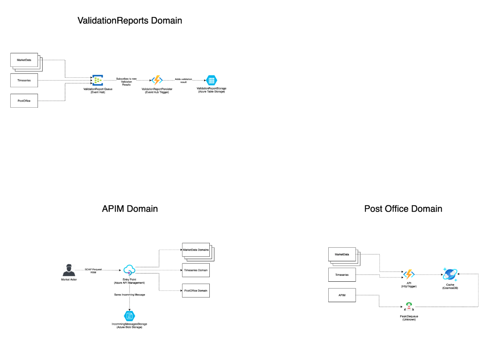

# Segregate the system into smaller chunks (domains)

* Status: decided
* Deciders: @renetnielsen, @MartinFHansen, @kft, @djorgensendk, @ftoft, @bemwen
* Date: 2021-02-09

## Context and Problem Statement

As a part of the ongoing discussions currently running on how to create a more modular/domain driven system, we have come up with a solution that means splitting the entire system into smaller pieces.

## Decision Drivers <!-- optional -->

* We need better support for commit teams, because the current structure with mono repo and folders does not give us the possibility to use the github teams tools.
* We need to be able to handle deployments of any given part of the system, without interfering with other parts of the system. (Breaking them).
* We need to be able to have a central place for everything that is related to an individual domain, to be able to easier give users an overview of the current domain they are working in.
* The mono repository strategy in github does not give us the tools we need to be able to support the above drivers.

## Decision Outcome

The current system will be segregated into smaller domains, currently we have identified 3 domains (more will follow). These domains will be put into separate repositories to support the decision drivers.
This includes

* IaC
* Code
* Documentation
* CI/CD

The currently identified domains:

* [MessageRouting](https://github.com/Energinet-DataHub/message-routing)
* [PostOffice](https://github.com/Energinet-DataHub/post-office)
* [ValidationReports](https://github.com/Energinet-DataHub/validation-reports)

As we progress further into these workshops with the business, we will identity more domains, especially in context of TimeSeries and MarketData.
These will then be added as a new ADR.

Based on this outcome, we would also need to create new ADR's.

* [ADR explaining how domains should communicate](https://github.com/Energinet-DataHub/green-energy-hub/issues/715)

### Positive Consequences <!-- optional -->

* We will get a more modular approach to the entire system, which will make it easier to develop and maintain features.
* We will be able to deploy a single part of the system, without having to be afraid of breaking other parts.
* We will be able to assign teams with ownership of domains (since they are now scoped to repositories), and therefor commit teams can be derived automatically, by using build in github features (teams).
* It will be easier for a business owner, to grasp the system, since they can relate to the given domain they are in.

### Negative Consequences <!-- optional -->

* There will be a transitional phase until this is up and running as expected.
* We need to figure out what parts of the current green-energy-hub repository needs to go into each domain.
