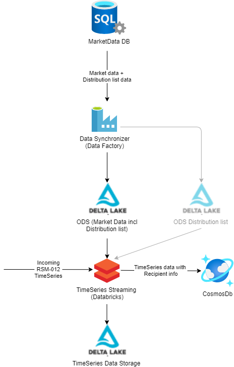

# Architecture for Distribution Lists for Market Evaluation Point Observations

* Status: decided
* Deciders: @BjarkeMeier, @prtandrup
* Date: 2021-02-01

Technical Story: ADO 108070: ODS Enabler: Design - Use of distribution list in Databricks

## Context and Problem Statement

Architecture on how to handle distribution list of market evaluation point time series needs to be decided. Any correlation to aggregations must be taken into account.

_MarketData DB in the context of this ADR simply represents "something" from where necessary data is fetched. This can be any kind of one or multiple microservices. The important thing, though, is that it should *not* be assumed to be a database with direct SQL access._

## Considered Options

1. Distribution list as part of the master data
2. Distribution list as its own ODS
3. Distribution list in mixed mode

 "Solution architecture")

Option 1 is shown with solid lines. Option 2 is shown with the dimmed "ODS Distribution list". Option 3 is a mixture of 1 and 2.

None of the solutions add any complexity regarding the _sync window problem_. See [ADR-0002](Charges domain\ADR-0002 Charges - Price Architecture.md) for more information about this problem.

**It is worth noting that this solution does not address distribution lists for aggregations as suggested by the current state of the architectural diagram of the whole system. Those distribution lists are different and thus require their own design decisions - and probably also solution.**

## Decision Outcome

Chosen option: option 1 "Handle distribution list as part of the master data", because it

* supports co-located logic relating to determine receivers
* simplifies the critical streaming job
* simplifies the architecture (by not introducing another ODS as outlined by the current architecture diagram)

## Pros and Cons of the Options <!-- optional -->

### [option 1] Distribution list as part of the master data

Distribution list is conceptually close to market data. In this option the distribution list is added to enrichment data. The list is added as an array in a new column in the existing master data for enrichment. Each element per receiver contains both the mRID and the role of the receiver.

* Good, because it supports co-located logic relating to determine receivers
* Good, because the streaming job becomes indifferent to changes to recipient requirements
* Good, because it simplifies the critical streaming job
* Good, because it simplifies the architecture (by not introducing another ODS as outlined by the current architecture diagram)
* Bad, because the size of enrichment data becomes bigger than what could have been achieved by calculating receivers inside the streaming job in cases where that could have been done without the need for external data
* Bad, because logic for determining some of the receivers have already been implemented in the streaming job and needs to be removed

### [option 2] Distribution list as its own ODS

Adding an "ODS Distribution list" next to MarketData ODS.

* Good, because it supports better separation-of-concerns - and thus exposes all the benefits that comes with this design pattern
* Good, because the streaming job becomes indifferent to changes to recipient requirements
* Bad, because it adds more infrastructure in the form of Data Synchronizer pipeline and ODS.
* Bad, because it adds more input sources for streaming job

### [option 3] Distribution list in mixed mode

Option 1 and 2 can be mixed in a number of ways trying to optimize various aspects of those two solutions. Both have been rejected because the cons are considered more important than the pros.

#### Variant 1: Calculate as many receivers inside streaming job

Some receivers can actually be calculated in the streaming based on a few system settings or the enrichment data that are already present. The idea of this variant is to only provide the receivers in the enrichment data that cannot be derived otherwise inside the streaming. The benefit should be to reduce the size of the enrichment data.

* Good, because it reduces ODS data size
* Bad, because it spreads business logic about receivers in multiple sub systems

#### Variant 2: Avoid duplicating energy supplier

This variant is a discussion on a tiny optimization. The question is whether the energy supplier should be present in the enrichment data in both it's own "column" (because it is needed by aggregations) and in the distribution list column together with the rest of the recipients. The idea is to achieve a minor reduction in the size of the enrichment data and avoiding duplicate data.

* Good, because it reduces amount of data
* Bad, because it increases complexity and violates separation-of-concerns

## A note on efficient ODS data fetching

Regarding possible concerns about efficient Data Synchronizer data retrieval from MarketData DB. There are several solutions for optimizing the fetch of data. These include:

* DBA optimizations like view, materialized views, denormalization, indexing and more
* Design patterns like eager read derivation, decoupled read database and corresponding updating using event driven architecture
