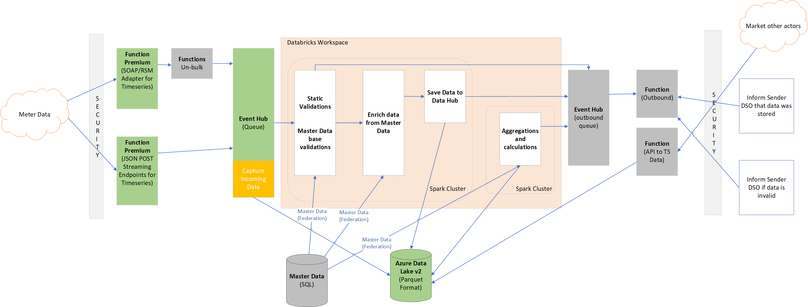

# Azure Databricks

Databricks is a managed Spark as a Service provider with all configuration and data stored on external to cluster media, while the cluster itself is a pluggable calculation provider that can be disposed or recreated at any moment in time.

Architecture top level view:

* Single Databricks workspace for production and ad-hoc queries.
* Dedicated on-demand auto-scalable clusters for batch jobs, streaming and experimentation.
* Data is stored in parquet format on Azure Data Lake connected to the clusters.
* Applications are jobs defined thru either notebooks (.scala/.py files) running automatically cell-by-cell or by jar files (Scala)/python modules, while parameters can be fed via the job configuration.
* Streaming and batch processing are preconfigured Databricks jobs running on dedicated clusters.
  Databricks Workspace provides scheduling.
* Data duplicates and updates are stored "as-is" in append-only format and then filtered during the first stage of processing and aggregation queries.
* Data federation (connection to external storage) is used to copy reference data into memory of spark job.
  Streaming job is restarted daily to update reference cache.

Below is the architectural diagram for this option:

